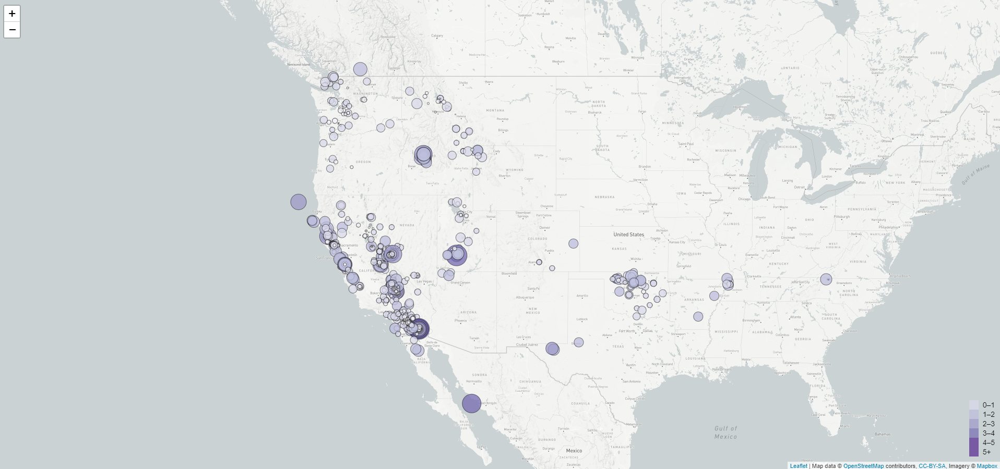
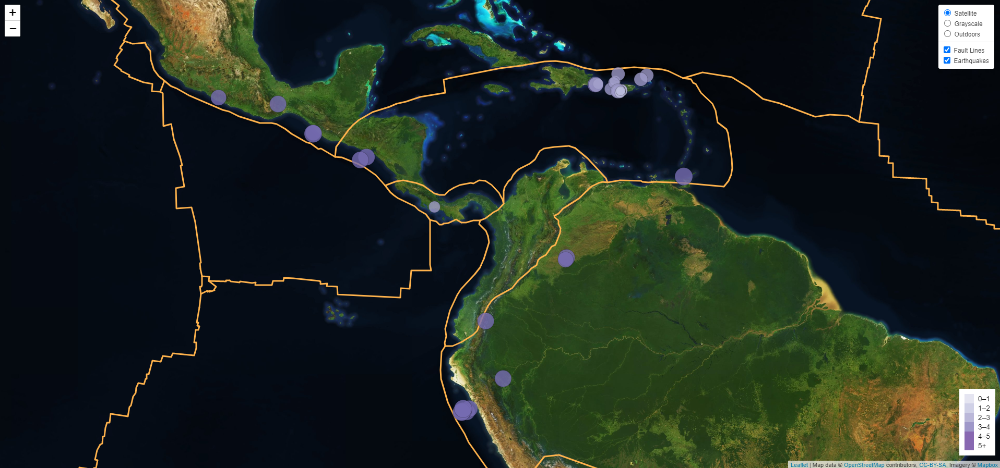

# Leaflet Homework - Visualizing Tectonic Plates and Earthquakes
---

## Data 

The data used in this challenge comes from two sources:

* [The United States Geological Survey](https://earthquake.usgs.gov/) provides earthquake data in a number of different formats, updated every 5 minutes. The dataset used to visualize the maps in this challenge was pulled from the [USGS GeoJSON Feed](http://earthquake.usgs.gov/earthquakes/feed/v1.0/geojson.php) page, more specifically, 'All Earthquakes from the Past 7 Days'

* [Data on World Tectonic Plates and Boundaries](https://github.com/fraxen/tectonicplates) presents tectonic plates and their boundaires, and in addition orogens and information about the boundaries. This was used to identify a relationship between tectonic plates and seismic activity.

## What was accomplished 
---

### Level 1: Visualise Earthquakes

The main objective of this first challenge was to create a map using Leaflet, that plots all of the earthquakes from the dataset based on their longitude and latitude. The features added were: 

* Data markers that reflect the magnitude of the earthquake in their size and color. 

* Popups that provide additional information about the earthquake when a marker is clicked

* A legend that porivdes context for the map data 

### Level 2: Visualise Earthquakes with Tectonic Plates

The main objective of this second challenge was to plot a second data set unto the first map that will illustrate the relationship between tectonic plates and seismic acticity. Addional features included were: 

* Multiple base maps to choose from as well as a separation of the two datasets into overlays that can be turned on and off independently 

* Layer controls to the map 
